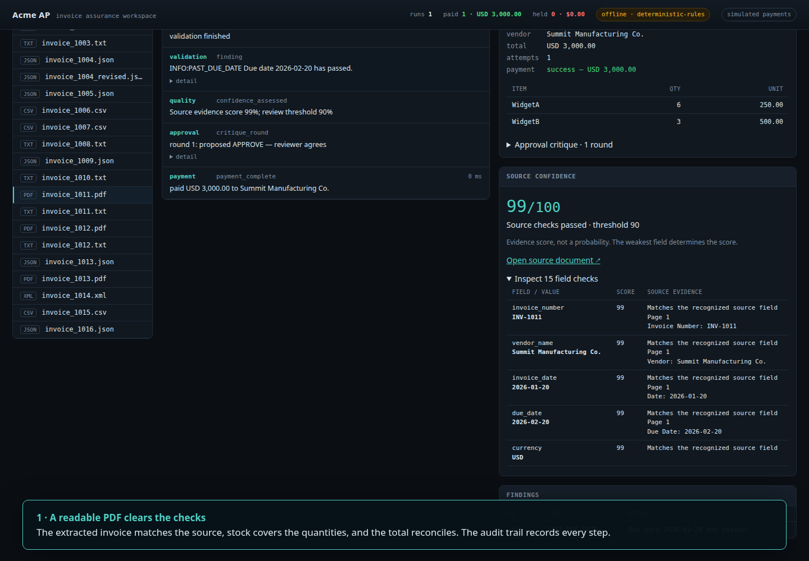
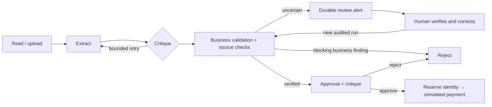

# Acme AP — evidence before payment

A working invoice-processing prototype for the [Galatiq FDE case](docs/CASE.md).
It reads PDF, text, JSON, CSV, and XML invoices, extracts their fields, checks
the source evidence and inventory, and either simulates payment, rejects the
invoice, or opens a persistent manual-review alert.

**Start with the [visual explainer](docs/EXPLAINER.html),
[engineering walkthrough](docs/RELIABILITY.md), or [recorded demo](docs/demo.mp4).**
The video runs the actual dashboard, including an image-only PDF and human review.



## Run it

```bash
python3 -m venv .venv
.venv/bin/pip install -e '.[dev]'
# Optional for image-only PDFs; readable PDFs work without OCR.
sudo apt-get install tesseract-ocr tesseract-ocr-eng fonts-dejavu-core
.venv/bin/python main.py --invoice_path=data/invoices/invoice_1011.pdf
.venv/bin/uvicorn acme_ap.api.app:app --port 8000
```

Open http://127.0.0.1:8000. Pick a sample or upload an invoice. `invoice_1006.csv`
demonstrates a confidence hold: the document does not specify currency.
Open **review queue**, inspect the source, enter verified corrections and a note,
then reprocess. The original extraction is retained; the new run rechecks all
business rules. All payments are simulated.

No API key is required. The default is a deterministic offline provider.
For the optional xAI provider, copy `.env.example` to `.env`, set your key and
a model available to your account, and select `LLM_PROVIDER=xai`.
The live provider is not required for any recorded demonstration or CI check.

## How trust is enforced



- Confidence comes from source checks, never a model grading itself. The lowest
  field score controls the invoice score. The default threshold is 0.90.
- Each checked field carries its extracted value, source value, reason, and an
  excerpt/page when available. These are evidence scores, not calibrated
  probabilities of accuracy.
- Native PDF text is read once per page. Scans use bounded local Tesseract OCR.
  OCR, unreadable pages, ambiguous dates/numbers, conflicting totals, repeated
  JSON keys, and incomplete source coverage create review alerts.
- Missing payment data, inconsistent line arithmetic, unknown products,
  insufficient aggregated stock, and duplicate invoices prevent payment.
- The database reserves invoice identity **before** the simulated payment call,
  including across concurrent processes. A reviewer cannot bypass business rules.
- Review records, source snapshots, corrections, decisions, and payments live in
  one SQLite database. Alerts also appear in the live event stream and dashboard.

## Verification

```bash
make check
```

The golden evaluation covers all 20 supplied documents. Policy `2026.09.2`
expects **9 paid, 9 rejected, and 2 needing review**, with zero false pays.
The two review cases previously defaulted silently to USD; their new expectations
are explained in [the golden specification](tests/golden/expectations.yaml).

The test suite also includes independent adversarial cases: coherent invented
extractions, dropped/repeated lines, invalid numbers, malformed and image-only
PDFs, concurrent payments, competing reviewers, upload limits, preserved source
snapshots, and correction workflows. The evaluation fails on field errors as
well as wrong decisions. The sample results do **not** measure accuracy on
unseen real-world invoices.

## Record the browser demo

```bash
.venv/bin/pip install -e '.[dev,demo]'
.venv/bin/python -m playwright install chromium
# ffmpeg and Tesseract must be available on PATH
make demo
```

The script starts its own local server, uses a temporary database and copied
samples, verifies each outcome in Chromium, captures screenshots, and encodes
`docs/demo.mp4`. No existing operator history is reset.

## Configuration and boundaries

See [.env.example](.env.example). The main controls are
`EXTRACTION_CONFIDENCE_THRESHOLD`, `MAX_EXTRACTION_ATTEMPTS`,
`MAX_PDF_PAGES`, `OCR_TIMEOUT_SECONDS`, `HIGH_VALUE_THRESHOLD`, and
`ARITHMETIC_TOLERANCE`. Uploads default to a 10 MB limit.

This is a local, single-operator prototype. It has no authentication, durable job
worker, external alert delivery, real bank integration, or calibrated OCR
benchmark. Reviewer names are recorded, not authenticated. A live xAI outage
fails closed and creates an alert; it does not silently switch an in-progress
run to offline payment. The offline extractor and source verifier share some
parser code, so their agreement is not independent proof of accuracy.
Unfamiliar layouts can require manual transcription.

The container includes OCR and runs as a non-root user. Before exposing the API
outside a trusted local environment, add authentication, permissions, a durable
worker, reconciliation, and an external alert outbox. More detail is in
[RELIABILITY.md](docs/RELIABILITY.md).

## Code map

| Area | Entry point |
|---|---|
| Shared CLI/API orchestration | `acme_ap/service.py`, `acme_ap/graph.py` |
| PDF/text readers and OCR | `acme_ap/ingestion/readers.py`, `ocr.py` |
| Evidence scoring | `acme_ap/ingestion/quality.py` |
| Business checks and payment reservation | `acme_ap/agents/`, `acme_ap/db/repository.py` |
| Review and upload API | `acme_ap/api/app.py`, `review.py` |
| Browser walkthrough | `scripts/record_demo.py` |

The original design rationale remains in [DECISIONS.md](DECISIONS.md). Its
historical scope is superseded by the reliability work described above.
